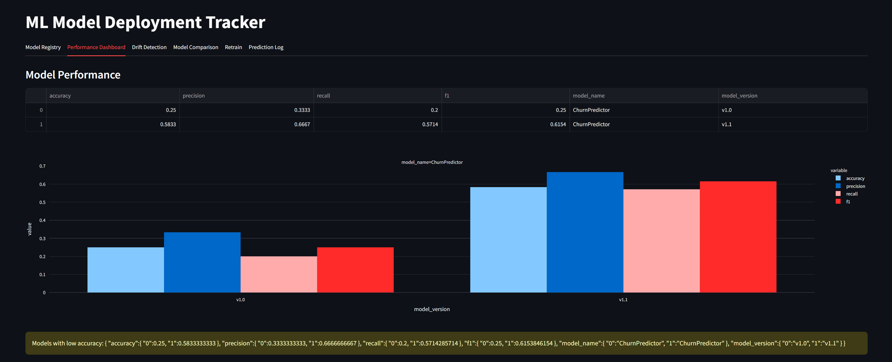

# ml-model-deployment-tracker

A Streamlit dashboard for monitoring machine learning models in production. It tracks model performance, detects data drift, and lets you compare model versions.



## Features
- **Model Registry** – track model name, version, accuracy, and status
- **Performance Dashboard** – view metrics like accuracy, precision, recall, F1, and latency
- **Drift Detection** – monitor input drift using Population Stability Index
- **Alert System** – warn when metrics fall below thresholds
- **Prediction Logger** – log predictions with confidence scores
- **Model Comparison** – compare two versions side by side
- **Retraining Trigger** – simulate model retraining events

## Setup
Install dependencies and run the app:
```bash
pip install -r requirements.txt
streamlit run app.py
```

Logs are stored in `data/predictions_log.csv` and model metadata in `model_registry.json`.